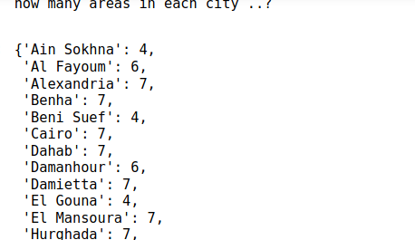

# elmenue_task
Elmenue Task

### This repo related to inet.works Elmenue Task

## for csv file with small data but complicated get

### how many areas in each city ..?
### how many zones in each of these areas ..?

### snapshots of data and solution

### Data

  

### how many areas in each city ..?

  
    
### how many zones in each of these areas ..?

  
